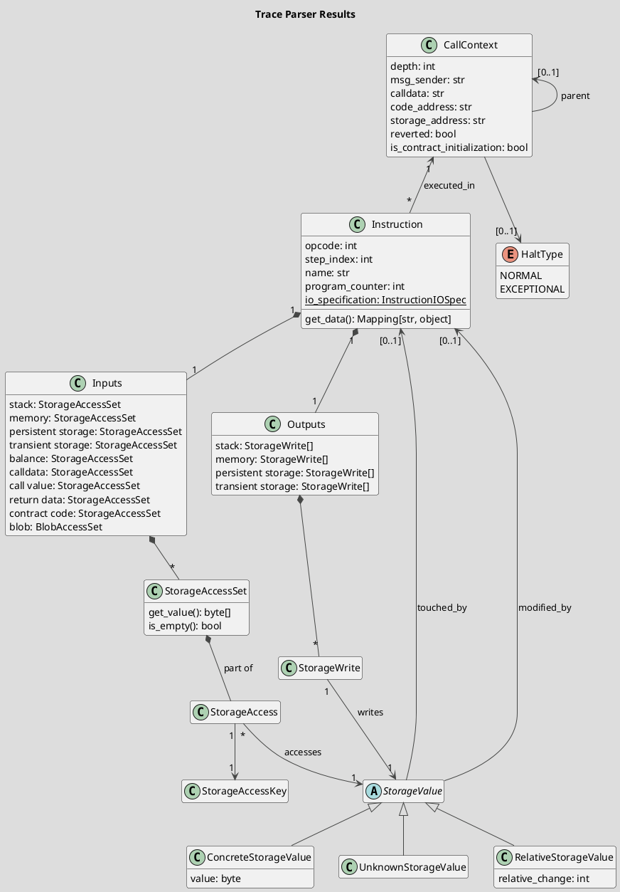
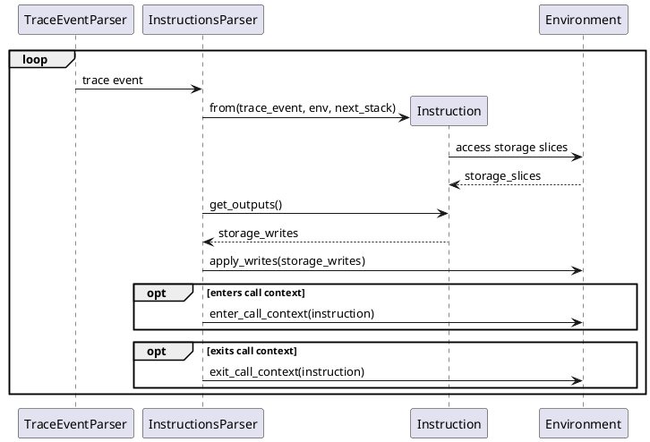

# Parsing

## Planned results



!!! note

    For the Outputs, we need at least the stack output, as we use this to detect TOD sources (eg for SLOAD and BALANCE). We don't include the call related data as these always reflect the inputs.

At each instruction, we keep track which inputs it uses and which outputs it produces. The values it uses stores information, about which instruction lastly outputted it without modifying its value (eg a CALL passing memory data to calldata) and which instruction lastly modified its value (eg an ADD summing two inputs to a new output value).

This helps us to track the information flow at a byte level, rather than grouping the values together per instruction. For instance, if a CALL takes multiple input parameters from the memory, the parameters will be composed of their own values with their own `touched_by` and `modified_by` fields. A `tokenAmount` would trace back to a different modifying instruction, than a `token` parameter in the same call.

## Planned parsing process



To create the instruction, we need:

- instruction metadata (opcode, name, pc)
- access to storages to create input StorageAccessSets
- access to the stack after the instruction for some output StorageWrites (for the others, the storage access is enough, eg current memory + stack)
- call_context to link it for later analysis

### Information Flow

To understand which instruction influenced the inputs of another instruction, we keep track which instructions modified a storage value. We keep track of the last instruction that **modified** the value. For instance, an ADD instruction will output a StorageValue with `modified_by == ADD`. However, a swap afterwards will only update the `touched_by`, the `modified_by` will continue to be the ADD instruction.

Information Flow backtracking: From the instruction inputs, find the instructions that have written these input values. Recursively continue from these instructions' inputs.

```
Start: instruction sink
let instruction = instruction_sink
let depends_on = set()
let next_inputs = instruction.inputs
while next_inputs {
  let inputs = next_inputs
  next_inputs = []
  for input in inputs {
    for storage_access in input.storage_access_set {
      let instr = storage_access.modified_by
      depends_on.append(instr)
      next_inputs.append(instr)
    }
  }
}
```

## Traces input

As inputs we take the execution traces from the transactions. These are based on the non-finalized [EIP-3155](https://eips.ethereum.org/EIPS/eip-3155) EVM trace specification.

!!! note

    We require the "pc", "op", "stack" and "depth" fields. For better instruction input and output analysis, the "memory" field should also be present, eg to identify the CALL and LOG inputs.

Here is an example trace for an SLOAD instruction:

```json
{
  "pc": 1157,
  "op": 84,
  "gas": "0x1f7b1",
  "gasCost": "0x834",
  "stack": [
    "0xd0e30db0",
    "...",
    "0xd7a8b5b72b22ea76954784721def9efafa7df99d65b759e7d1b78f9ee0094fbc"
  ],
  "memory": "0x00..080",
  "depth": 2,
  "returnData": "0x",
  "refund": "0x0",
  "memSize": "96",
  "opName": "SLOAD"
}
```

## Map each JSON to a `TraceEvent`

This step simply maps a trace event from JSON to a python class (`TraceEvent`).

Currently this is only implemented for traces generated with REVM (based on EIP-3155). However, new implementations could map other traces formats to `TraceEvent`, as long as the necessary information is included in the trace.

## Parse `Instruction`s and the `CallTree`

Here, we parse the instructions and keep track in which contract they were executed.

We start the process with an initial `CallContext`, which stores who created the transaction and which contract/EOA is called.

Then we iterate through the `TraceEvent`s, always looking at two successive `TraceEvent`s. Based on these events we create an `Instruction` object, which specifies the EVM instruction, its inputs and also its outputs. For some instructions the call context is important, so we link the current `CallContext` to the instruction. For instance, an `SLOAD` instruction loads the data from the current contracts storage.

If we encounter a call instruction (`CALL`, `STATICCALL`, `CALLCODE`, `DELEGATECALL`, `CREATE` or `CREATE2`) we create a new `CallContext`. On a `STOP`, `RETURN`, `REVERT` or `SELFDESTRUCT` we mark the current one as reverted and go back to the previous `CallContext`. If the depth of the next event is one lower than the current one, we assume an exceptional halt and also revert the current transaction. If the depth of the next event is unexpected, we throw an `UnexpectedDepthChange` Exception.

The `Instruction` includes:

- opcode
- name (mnemonic for opcode)
- program_counter
- call_context
- stack_inputs
- stack_outputs
- memory_input
- memory_output
- data (additional fields based on the instruction type, eg `key` for `SLOAD`)
